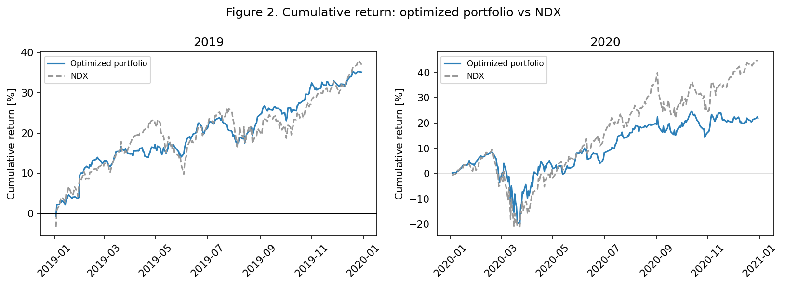

# CVaR-Based Portfolio Optimization

Building low-risk equity portfolios with **linear programming**, trained on 2019 NASDAQ-100
returns and stress-tested through the 2020 COVID crash.

> MSBA Optimization · Project 1 · Group 11 — Emma Trunnell, Nathan Arimilli, Nikhil Kumar, Satvik Shankar

---

## Problem

Value-at-Risk (VaR) tells you a loss threshold but ignores how bad the tail beyond it gets, and it
is non-convex. **Conditional Value-at-Risk (CVaR)** — the average loss in the worst `(1−β)` fraction
of days — is convex and optimizer-friendly. Using daily prices for 100 NASDAQ-100 constituents (the
`NDX` index is a benchmark only, never an investable asset), we build a portfolio that **minimizes
CVaR** subject to a budget and a minimum-return floor, then ask:

1. How does the 2019-optimal portfolio hold up in 2020, and versus the index? *(Task 2)*
2. How does the confidence level **β** reshape the allocation and its risk? *(Task 3)*
3. What if we instead minimize the **worst single month's** CVaR? *(Task 4 — minimax)*
4. Does **re-optimizing every month** on a rolling year help? *(Task 5)*
5. Are those monthly portfolios **stable** enough to trade? *(Task 6)*

## Approach

The Rockafellar–Uryasev linearization turns CVaR minimization into a clean LP (≈351 variables,
≈252 constraints) solved with **Gurobi**:

$$\min_{x,\alpha,u}\; \alpha + \tfrac{1}{(1-\beta)T}\textstyle\sum_k u_k \quad\text{s.t.}\quad
u_k \ge -\textstyle\sum_j x_j y_{kj}-\alpha,\; u_k\ge 0,\; \textstyle\sum_j x_j=1,\;
\textstyle\sum_j \mu_j x_j \ge R,\; 0\le x_j\le 1.$$

Every reported CVaR (in-sample, out-of-sample, benchmark) uses the **same** definition the LP
minimizes, so the in-sample number equals the LP objective exactly.

## Key results

| Result | Value |
|---|---|
| Baseline portfolio CVaR, in-sample (2019, β=0.95) | **1.11 %** |
| Baseline portfolio CVaR, out-of-sample (2020) | **4.66 %** |
| NDX benchmark CVaR (2020) | 5.65 % |
| Out-of-sample CVaR at β=0.99 | **9.66 %** (vs 4.66 % at β=0.95) |
| Effective # holdings as β rises (0.90 → 0.95 → 0.99) | 7.1 → 5.4 → 3.6 |
| Minimax vs β=0.99 allocation | **cosine 1.00** — essentially identical |
| Rolling re-optimization, avg monthly CVaR (2020) | 3.23 % (beat static in only **5/12** months) |
| Stable month-to-month transitions (≤ 5 pp) | **18 %** |

**Takeaways.** CVaR optimization reliably lowers tail risk *relative to the index* in both years,
but the optimal portfolio is concentrated and does **not** generalize across the 2020 regime break
(tail risk rose ~4×). Pushing β to the extreme tail (0.99) over-fits and nearly doubles out-of-sample
losses. The minimax objective collapses onto the same ultra-conservative tilt as β=0.99. And —
contrary to first intuition — month-by-month re-optimization did **not** reliably beat simply holding
the 2019 portfolio, while generating heavy turnover. Recommended policy: **β=0.95 with
turnover-controlled rebalancing**. Full discussion in [`report/REPORT.md`](report/REPORT.md).



*The optimized portfolio takes a shallower March-2020 drawdown (downside protection working) but
then lags the tech-led recovery — the risk/return trade-off in one picture.*

## Repository structure

```
.
├── data/                       # input price data
│   ├── stocks2019.csv          #   2019 daily prices (100 NDX constituents + NDX)
│   └── stocks2020.csv          #   2020 daily prices
├── code/
│   ├── cvar_portfolio.py       # end-to-end analysis (single source of truth)
│   └── Optimization_Project1_CVaR.ipynb   # narrative notebook (executed)
├── output/
│   ├── figures/                # 9 labelled figures (PNG)
│   └── *.csv                   # result tables incl. key_results.csv
├── report/
│   ├── REPORT.md / REPORT.pdf  # full write-up
│   └── assignment_prompt.pdf   # original project brief
├── requirements.txt
└── README.md
```

## Reproduce

```bash
pip install -r requirements.txt        # pandas, numpy, matplotlib, gurobipy
python code/cvar_portfolio.py          # regenerates output/figures/ and output/*.csv
```

The free `gurobipy` license shipped with pip is sufficient for this problem size. The only inputs
are the two CSV paths at the top of [`code/cvar_portfolio.py`](code/cvar_portfolio.py); every result
is computed from variables (no hard-coded numbers), so the analysis re-runs unchanged on new data.
To explore interactively, open the notebook:

```bash
jupyter notebook code/Optimization_Project1_CVaR.ipynb
```

## Data & honest caveats

- **Data:** daily closing prices for the 100 NASDAQ-100 constituents plus the `NDX` index, 2019 and
  2020 (class-provided, safe to publish). Returns are simple daily `pct_change`.
- **Scope:** long-only, fully-invested, single-period daily CVaR. No transaction costs, taxes, or
  shorting; the return floor `R = 0.02%/day` and `β = 0.95` follow the assignment.
- **Generalization:** 2019→2020 is a deliberate stress test. Results show CVaR optimization controls
  *relative* risk well but is **not** robust to a sudden regime change — a genuine limitation, not a
  bug. The rolling-vs-static comparison is reported on a like-for-like monthly basis, which is *less*
  flattering to re-optimization than an annual-vs-monthly comparison would be.
- **Reproducibility:** the LP is deterministic (no random seed needed) and uses relative paths.
