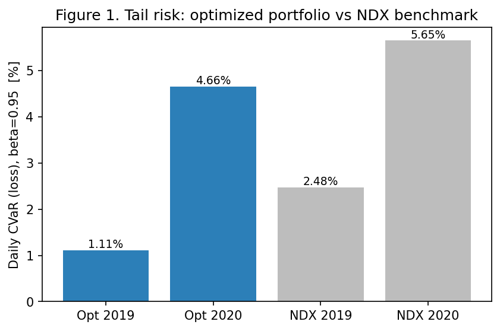
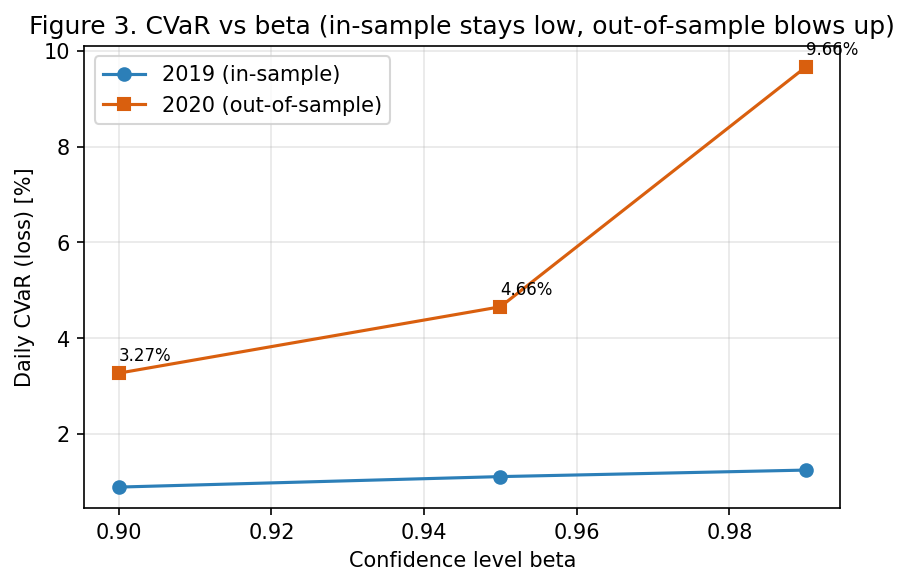
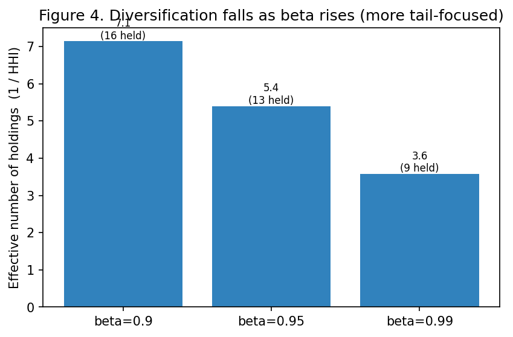
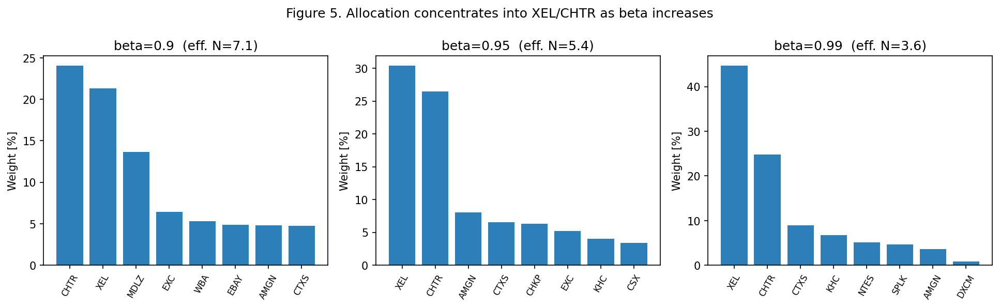
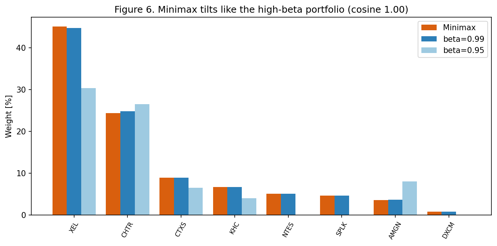
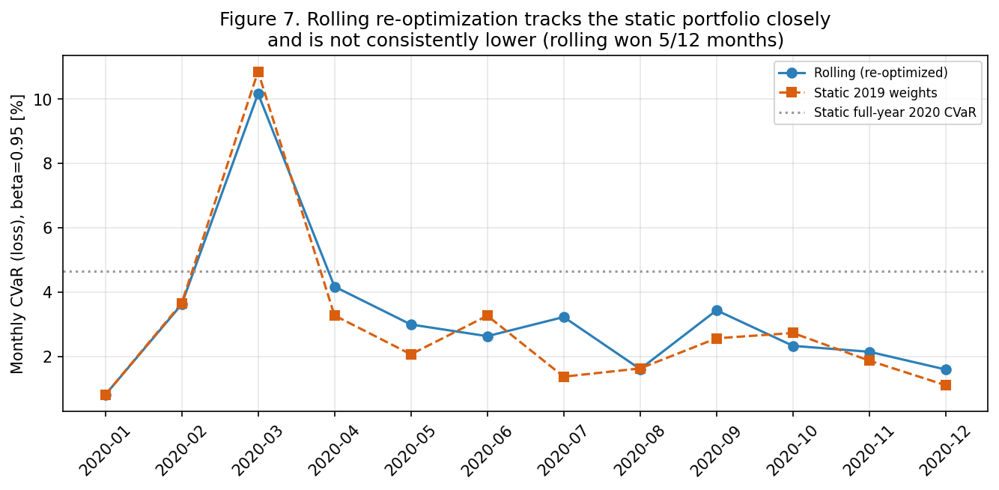
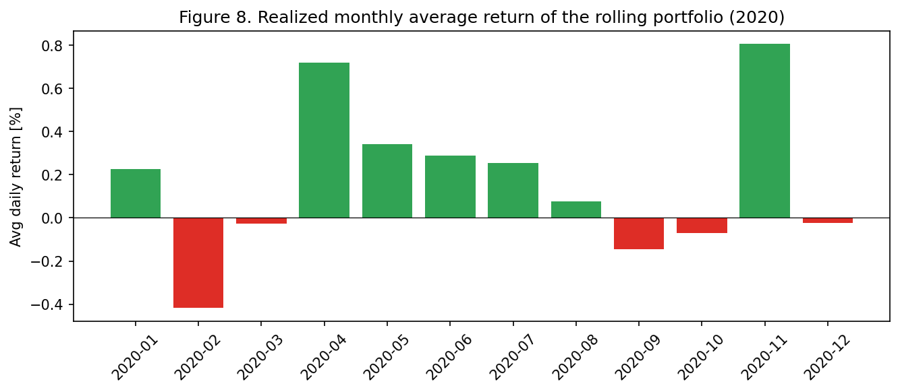
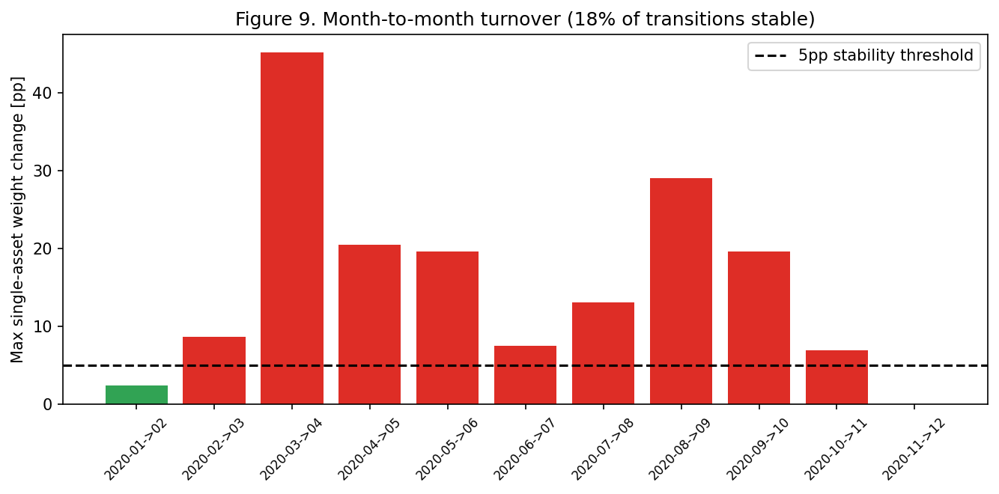

# CVaR-Based Portfolio Optimization

**MSBA Optimization · Project 1 · Group 11**
Emma Trunnell · Nathan Arimilli · Nikhil Kumar · Satvik Shankar

A linear-programming approach to building low-risk equity portfolios, trained on 2019
NASDAQ-100 returns and stress-tested through the 2020 COVID shock.

---

## Executive summary

We minimize **Conditional Value-at-Risk (CVaR)** — the average loss in the worst
$(1-\beta)$ tail of days — using the Rockafellar–Uryasev linear program. Training on 2019
and testing on 2020 gives a clear, honest picture of what tail-risk optimization can and
cannot do across a regime change.

| Result | Value |
|---|---|
| Baseline portfolio CVaR, in-sample (2019, $\beta{=}0.95$) | **1.11 %** |
| Baseline portfolio CVaR, out-of-sample (2020) | **4.66 %** |
| NDX benchmark CVaR (2020) | 5.65 % |
| Out-of-sample CVaR at $\beta{=}0.99$ | **9.66 %** (vs 4.66 % at $\beta{=}0.95$) |
| Minimax vs $\beta{=}0.99$ allocation similarity | **cosine 1.00** (nearly identical) |
| Rolling re-optimization, avg monthly CVaR (2020) | 3.23 % (won only **5/12** months vs static) |
| Stable month-to-month transitions ($\le 5$ pp) | **18 %** |

**Bottom line.** CVaR optimization reliably lowers tail risk *relative to the index*, but the
optimal portfolio is concentrated and does not generalize across a regime break: 2020 tail
risk was ~4× the 2019 level. Pushing $\beta$ toward the extreme tail over-fits and roughly
doubles out-of-sample losses. Monthly re-optimization, contrary to first intuition, did **not**
reliably beat a static portfolio on a like-for-like basis, and it incurred heavy turnover. We
recommend $\beta=0.95$ with turnover-controlled rebalancing.

---

## I. Introduction

Value-at-Risk (VaR) reports a loss threshold but ignores how bad losses *beyond* it can get,
and it is non-convex and not sub-additive. **CVaR** (a.k.a. Expected Shortfall / Mean Excess
Loss) is the conditional expectation of losses past VaR; it is convex and behaves well inside an
optimizer. Using daily prices for 100 NASDAQ-100 constituents (the `NDX` index column is kept
only as a benchmark, never as an investable asset), we:

1. minimize CVaR at $\beta = 0.90, 0.95, 0.99$ and compare in- vs out-of-sample performance;
2. test a **minimax** variant that minimizes the *worst month's* CVaR;
3. **re-optimize monthly** in 2020 on a rolling 12-month window; and
4. assess the **stability** (turnover) of the resulting monthly allocations.

2019→2020 is a deliberate stress test: a calm year followed by the COVID crash.

---

## II. Model and methodology

### Notation

| Symbol | Meaning |
|---|---|
| $j = 1,\dots,N$ | investable assets ($N = 100$) |
| $k = 1,\dots,T$ | daily return scenarios in the training window |
| $y_{kj}$ | return of asset $j$ on day $k$ (parameter) |
| $\mu_j = \tfrac1T\sum_k y_{kj}$ | mean daily return of asset $j$ (parameter) |
| $\beta$ | confidence level (parameter, e.g. 0.95) |
| $R$ | minimum required daily expected return (parameter, $0.02\%$) |
| $x_j \ge 0$ | **decision** — portfolio weight in asset $j$ |
| $\alpha$ | **decision** — VaR variable (the loss threshold) |
| $u_k \ge 0$ | **decision** — excess loss of day $k$ beyond $\alpha$ |

### The linear program

The Rockafellar–Uryasev linearization replaces the non-smooth $[\,\cdot\,]_+$ in the CVaR
definition with the auxiliary variables $u_k$:

$$
\min_{x,\,\alpha,\,u}\;\; \alpha \;+\; \frac{1}{(1-\beta)\,T}\sum_{k=1}^{T} u_k
$$

subject to

$$
u_k \;\ge\; -\sum_{j=1}^{N} x_j\, y_{kj} \;-\; \alpha, \qquad u_k \ge 0 \quad (k=1,\dots,T)
$$
$$
\sum_{j=1}^{N} x_j = 1 \quad\text{(budget)}, \qquad
\sum_{j=1}^{N} \mu_j x_j \ge R \quad\text{(return floor)}, \qquad
0 \le x_j \le 1 \quad\text{(long-only)}.
$$

At the optimum $\alpha$ equals the $\beta$-VaR and the objective equals the portfolio's CVaR.
The model is solved with **Gurobi**; for $T\approx 250$ days and $N=100$ assets it has ~351
variables and ~252 constraints and solves in well under a second.

### Consistent risk evaluation

Every reported CVaR — in-sample, out-of-sample, and the NDX benchmark — uses the **same
definition the LP minimizes**, so the in-sample number equals the LP objective exactly:

$$
\mathrm{VaR}_\beta = \beta\text{-quantile of losses},\qquad
\mathrm{CVaR}_\beta = \mathrm{VaR}_\beta + \frac{1}{1-\beta}\,\mathbb{E}\big[(\text{loss}-\mathrm{VaR}_\beta)_+\big].
$$

### Variants

- **Minimax (Part 4).** One static weight vector $x$ and a free scalar $t$ with
  $t \ge \mathrm{CVaR}_m(x)$ for each month $m$ of 2019; minimize $t$. This protects the single
  worst month rather than the year-average.
- **Rolling re-optimization (Part 5).** For each month of 2020, re-solve the baseline LP on the
  **12 calendar months immediately preceding** it (January 2020 uses Jan–Dec 2019; February 2020
  uses Feb 2019–Jan 2020), then measure realized CVaR within the target month.

---

## III. Results and analysis

### Part 2 — Baseline ($\beta = 0.95$, $R = 0.02\%$/day)

Trained on 2019 and held through 2020, the optimized portfolio has lower tail risk than the
NDX benchmark in **both** years, but its absolute CVaR quadruples across the regime change.

| Metric | Optimized 2019 | Optimized 2020 | NDX 2019 | NDX 2020 |
|---|---|---|---|---|
| Avg daily return | 0.12 % | 0.10 % | 0.13 % | 0.17 % |
| Volatility (std) | 0.68 % | 1.94 % | 1.03 % | 2.30 % |
| VaR (loss), $\beta{=}0.95$ | 0.85 % | 2.53 % | 1.60 % | 3.90 % |
| **CVaR (loss), $\beta{=}0.95$** | **1.11 %** | **4.66 %** | 2.48 % | 5.65 % |



*Figure 1. The optimized portfolio carries less tail risk than NDX in both years, but the
2019→2020 jump (1.11 %→4.66 %) shows the non-stationarity of the COVID shock.*

The portfolio is moderately concentrated — **13 holdings, effective $N \approx 5.4$** — led by
**XEL (30 %)** and **CHTR (27 %)**, low-volatility utility/telecom names that anchor the tail.
The cumulative-return view makes the risk–return trade-off concrete:


*Figure 2. In 2019 the portfolio tracks NDX. In 2020 it suffers a noticeably shallower March
drawdown (the design working as intended) but then lags the tech-led recovery, finishing ~+22 %
vs NDX ~+45 %. Downside protection is paid for in forgone upside.*

**Is it a good idea to hold the 2019 portfolio through 2020?** Only partially. It beat the index
on tail risk, but its own CVaR rose ~4×, confirming that a single-year fit does not transfer
across regimes — motivating the re-optimization studies below.

### Part 3 — Sensitivity to $\beta$

| | $\beta = 0.90$ | $\beta = 0.95$ | $\beta = 0.99$ |
|---|---|---|---|
| 2019 CVaR (in-sample) | 0.89 % | 1.11 % | 1.25 % |
| 2020 CVaR (out-of-sample) | 3.27 % | 4.66 % | **9.66 %** |
| Effective # holdings (1/HHI) | 7.1 | 5.4 | 3.6 |
| # holdings with weight > 0 | 16 | 13 | 9 |



*Figure 3. In-sample CVaR rises only gently with $\beta$, but out-of-sample CVaR explodes —
$\beta{=}0.99$ nearly doubles the 2020 tail loss versus $\beta{=}0.95$.*

**Quantifying diversification (not just "it looks concentrated").** Using the Herfindahl index
$\mathrm{HHI}=\sum_j x_j^2$ and its number-equivalent $1/\mathrm{HHI}$, the *effective* number of
holdings falls monotonically **7.1 → 5.4 → 3.6** as $\beta$ rises. Higher $\beta$ tells the
optimizer to obsess over the deepest 1 % of days, which it can only do by piling into a few
ultra-defensive names — precisely the bet that misfires when the next year's tail looks nothing
like last year's.



*Figure 4. Effective number of holdings vs $\beta$ — a concrete diversification metric.*



*Figure 5. As $\beta$ rises, capital concentrates into XEL/CHTR and the tail of small positions
disappears.*

### Part 4 — Minimax: minimize the worst month's CVaR (2019)

| | Value |
|---|---|
| 2019 worst-month CVaR (minimax objective) | **1.24 %** |
| 2020 out-of-sample daily CVaR (minimax weights) | 4.73 % |
| 2020 out-of-sample daily CVaR (baseline, Part 2) | 4.66 % |

The minimax portfolio caps the worst 2019 month at 1.24 % but barely moves 2020 tail risk
(4.73 % vs 4.66 %). **The interesting finding is its similarity to the high-$\beta$ solution:**

| Comparison | Cosine similarity | $L_1$ weight distance | Shared top-5 |
|---|---|---|---|
| Minimax vs $\beta{=}0.99$ | **1.000** | 0.011 | 5 / 5 |
| Minimax vs $\beta{=}0.95$ | 0.933 | 0.622 | 3 / 5 |



*Figure 6. The minimax and $\beta{=}0.99$ allocations are essentially the same portfolio
(cosine 1.00). Both load ~45 % XEL and ~24 % CHTR.*

This makes intuitive sense: minimizing the **worst month** and minimizing the **deepest tail**
($\beta{=}0.99$) are both extreme, conservative objectives, so they converge on the same handful
of defensive assets. Minimax is therefore best viewed not as a distinct strategy but as another
route to a very conservative, concentrated tilt — useful when an investor's overriding concern is
clustered, single-period losses.

### Part 5 — Monthly re-optimization (rolling 12 months, 2020)

Re-optimizing each month on its trailing year gives the monthly CVaR profile below. To judge it
fairly we compare against the **static** 2019 portfolio evaluated in the **same** months
(apples-to-apples), not against the static *full-year* number.

| Statistic (rolling, 2020) | Value |
|---|---|
| Average monthly CVaR | 3.23 % |
| Std. dev. across months | 2.39 % |
| Minimum monthly CVaR | 0.81 % (Jan) |
| Maximum monthly CVaR | **10.17 %** (Mar) |
| Static 2019 portfolio, average monthly CVaR | 2.94 % |
| Months rolling beat static | **5 / 12** |



*Figure 7. Rolling re-optimization tracks the static portfolio closely and is **not**
consistently lower; the March 2020 spike dominates both.*

**Why doesn't re-optimization always help?** This is the key, honest result. On a like-for-like
monthly basis the rolling strategy's average CVaR (3.23 %) was actually **slightly higher** than
simply holding the 2019 portfolio (2.94 %), and it won only 5 of 12 months. The reason: the
rolling window is *backward-looking*. Each month it fits the last 12 months, so when the regime
breaks (March 2020) it has no information about the coming shock — it is still positioned for the
prior calm year. Re-optimization adapts to *gradual* drift but cannot anticipate a *sudden*
regime change, and it pays for the attempt in turnover (Part 6). The naive comparison of rolling
average-monthly CVaR (3.23 %) against the static *annual* CVaR (4.66 %) is misleading because
those are different horizons; the correct monthly-vs-monthly comparison shows little benefit.



*Figure 8. Realized monthly average return of the rolling portfolio: several high-CVaR months
(e.g. Apr–May) still delivered positive returns, underscoring that high tail risk is not the same
as poor realized performance.*

### Part 6 — Stability of the monthly allocations

A transition is "stable" if no single asset's weight moves more than 5 percentage points
month-to-month. Only **18 % (2/11)** of transitions qualify; the largest single move is **45 pp**
(CTXS, into the March crash).



*Figure 9. Most month-to-month transitions breach the 5 pp threshold, with extreme reallocations
clustered around the spring-2020 turmoil.*

**Enforcing stability without re-deriving the model.** The CVaR LP stays linear if we add, for
each asset $j$ and month $t$, turnover bounds

$$ -0.05 \;\le\; x_{j,t} - x_{j,t-1} \;\le\; 0.05, $$

or instead penalize total turnover $\lambda\sum_j |x_{j,t}-x_{j,t-1}|$ in the objective (the
absolute value is linearized with auxiliary variables exactly as the CVaR tail is). The first
hard-caps drift; the second trades tail-risk reduction against trading intensity via $\lambda$.
Given that Part 5 showed little risk benefit from unconstrained re-optimization, the
turnover-penalty form is the sensible production choice.

---

## IV. Conclusions and recommendation

1. **CVaR optimization works as a relative risk control** — the optimized portfolio beat NDX on
   tail risk in both 2019 and 2020 — but it is **not robust to regime change**: 2020 tail risk
   was ~4× 2019's.
2. **Do not over-tune $\beta$.** $\beta=0.99$ looks marginally better in-sample yet nearly doubles
   out-of-sample CVaR; it concentrates the book into ~3–4 effective names. $\beta=0.95$ is the
   sweet spot between protection and diversification.
3. **Minimax ≈ the high-$\beta$ portfolio** — a useful equivalence: if your concern is the worst
   single period, you are implicitly choosing a very conservative, concentrated allocation.
4. **Monthly re-optimization did not reliably reduce risk** on a fair comparison, and it generated
   large turnover (only 18 % stable transitions). Adaptiveness has a cost and no guaranteed payoff
   against sudden shocks.

**Recommendation.** Use $\beta = 0.95$ as the default. Rebalance on a schedule (e.g. quarterly),
but **constrain turnover** — either a 5 pp per-asset cap or a turnover penalty — so the portfolio
adapts to drift without churning through a crisis. Monitor rolling CVaR as an early-warning gauge
rather than as a trigger for aggressive monthly re-optimization.

---

## Appendix — Reproducibility

All numbers and figures in this report are produced by
[`code/cvar_portfolio.py`](../code/cvar_portfolio.py) (the single source of truth) and narrated in
[`code/Optimization_Project1_CVaR.ipynb`](../code/Optimization_Project1_CVaR.ipynb). To reproduce:

```bash
pip install -r requirements.txt        # pandas, numpy, matplotlib, gurobipy
python code/cvar_portfolio.py          # writes output/figures/ and output/*.csv
```

The only inputs are the two CSV paths at the top of `cvar_portfolio.py`; every result is computed
from variables (no hard-coded numbers), so the analysis re-runs unchanged on new data. The core
CVaR LP is reproduced below.

```python
def solve_cvar_lp(returns_df, beta=0.95, R=0.0002):
    T, N = returns_df.shape
    Y = returns_df.values                       # T x N scenario matrix
    mu = returns_df.mean(axis=0).values         # expected return per asset
    m = Model("cvar_min"); m.Params.OutputFlag = 0
    x = m.addVars(N, lb=0.0, ub=1.0)            # weights
    alpha = m.addVar(lb=-GRB.INFINITY)          # VaR
    u = m.addVars(T, lb=0.0)                     # tail-loss slacks
    m.addConstr(quicksum(x[j] for j in range(N)) == 1.0)            # budget
    m.addConstr(quicksum(mu[j]*x[j] for j in range(N)) >= R)        # return floor
    for k in range(T):
        m.addConstr(u[k] >= -quicksum(Y[k, j]*x[j] for j in range(N)) - alpha)
    coef = 1.0 / ((1.0 - beta) * T)
    m.setObjective(alpha + coef*quicksum(u[k] for k in range(T)), GRB.MINIMIZE)
    m.optimize()
    return {"x": [x[j].X for j in range(N)], "alpha": alpha.X, "obj": m.ObjVal}
```
